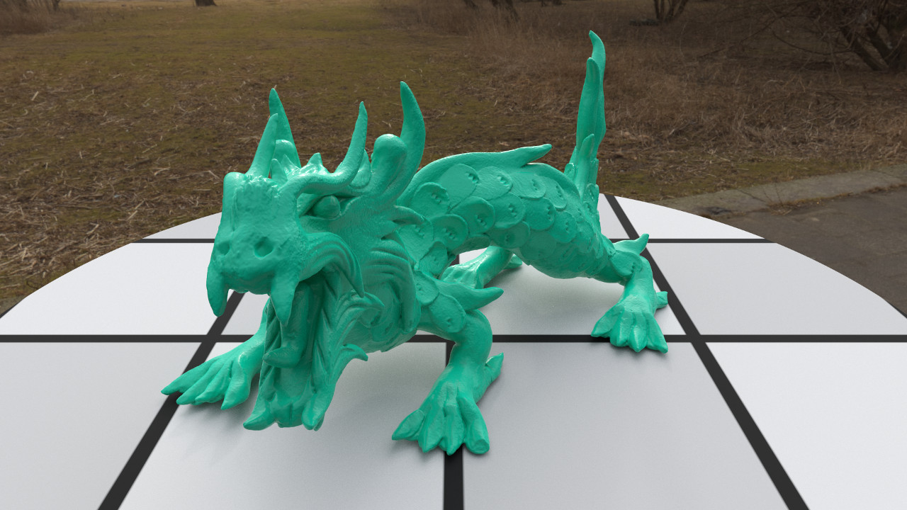

sprout
======

== Brief

sprout is a small raytracing renderer written in C++. I work on it mainly for fun and to learn about physically based rendering and global illumination.

The overall architecture is heavily inspired by http://www.pbrt.org/[PBRT] while the implementation details differ more or less strongly in different places.

At the moment the most advanced integrator is a uni-directional path tracer with forward prediction and multiple importance sampling. Area lights and HDRI lights are supported. The default material is a combination of qualitative Oren-Nayar and GGX with roughness and metallic parameters similar to the http://blog.selfshadow.com/publications/s2013-shading-course/karis/s2013_pbs_epic_notes_v2.pdf[Unreal 4 presentation]. There is support for a few built in shapes (sphere, disk, plane...) as well as triangle meshes.

A render is configurable by various json files that describe the different parts of the scene (shapes, lights, materials etc.) as well as the camera settings.

== Installation

All source files needed to build the project are included in the repository. In order to build the project Qt Creator is needed. Unfortunately there doesn't exist a cmake project yet.

sprout uses std::make_unique which is part of c+\+14.

On Linux it might be be neccessary to persuade Qt Creator to use the c+\+14 flag for the compiler. I've had trouble with this in the https://forum.qt.io/topic/52334/qmake-substituting-c-14-with-c-1[past]. Then it should work with Clang 3.5 and libstdc++ 4.9 or higher. It should also build with GCC 4.9 or higher.

On Windows it should work out of the box with the Visual Studio 2013 and 2015 compilers.

== Dependencies

I try to keep the dependencies reasonably low in this project. At the moment there are three of them. All of them are header-only libraries and included in the repository.

.Dependencies
. https://code.google.com/p/miniz/[Miniz] for encoding/decoding PNG images and decompressing gz archives
. https://github.com/miloyip/rapidjson[RapidJSON] for parsing json files
. http://tclap.sourceforge.net/[TCLAP] for parsing command line arguments

If you have https://www.ffmpeg.org/[FFmpeg] installed you can export animations to mp4, but it is neither required to build nor to run.

